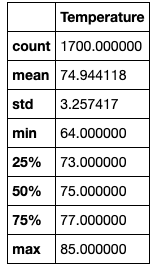
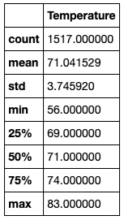

# Surfs_Up

## Overview of Analysis
In this analysis we used Python, Pandas functions and SQLAlchemy to gather information on temperature trends in Oahu, Hawaii. The temperature data was retrieved from a SQLite database. The information produced from the analysis will then be used by a local surf shop to determine business trends and sustainability. 

## Results 

First we imported the necessary dependencies, Python SQL toolkit and object relational mapper (ORM). Using the create_engine function we then started the process of connecting the SQLite database which contains the data for our analysis. A base class was created and the database tables were reflected to our code. After creating references to each class, a session link was created to begin the query for data. 

1) In the first deliverable we filtered the date column of the Measurements table to extract all the temperatures from the month of June. The temperatures were converted to a list, which was then used to create a dataframe. The describe() function was used to gather statistics on this dataframe, such as mean temperature, max and min temps etc. The image below shows the summary statistics for June temperatures. 

2) Similar to deliverable 1, we filtered the data column of the Measurements table to now extract all the temperatures from the month of June. The image below shows the summary statistics for December temperatures. 

### Key Differences
* aasdkas
